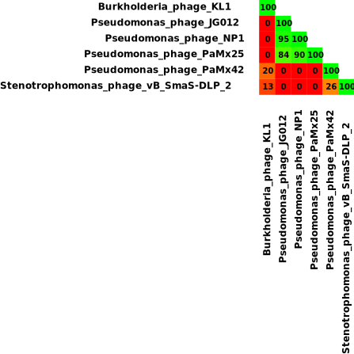

Multiple genome comparison using accession numbers
==================================================
In order to use ``all_vs_all_nt.sh`` with accession numbers, you just have to name your fasta files and fasta headers with the corresponding names
```bash
cat genome_order
Burkholderia_phage_KL1.fasta
Pseudomonas_phage_JG012.fasta
Pseudomonas_phage_NP1.fasta
Pseudomonas_phage_PaMx25.fasta
Pseudomonas_phage_PaMx42.fasta
Stenotrophomonas_phage_vB_SmaS-DLP_2.fasta

grep \> Stenotrophomonas_phage_vB_SmaS-DLP_2.fasta
>Stenotrophomonas_phage_vB_SmaS-DLP_2
```

The order in the ``genome_order``  file indicates how the matrix is going to be drawn using ``draw_matrix.sh``

